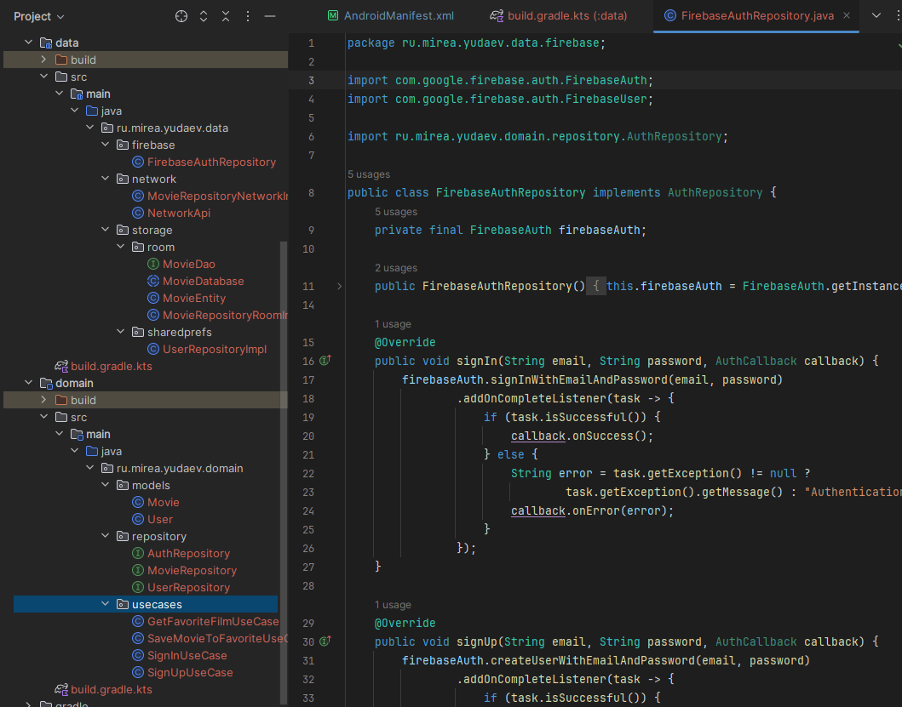
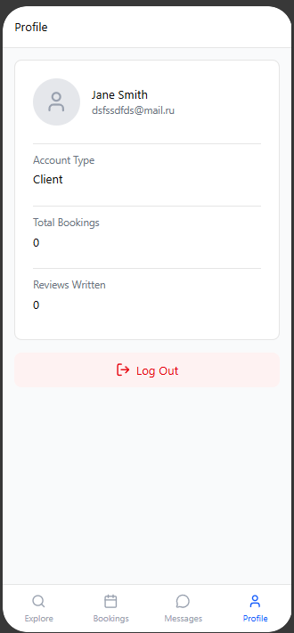
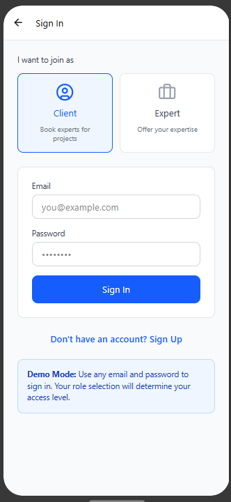
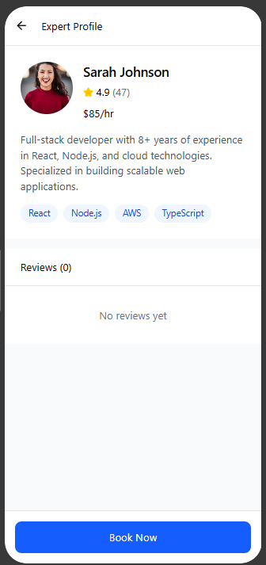
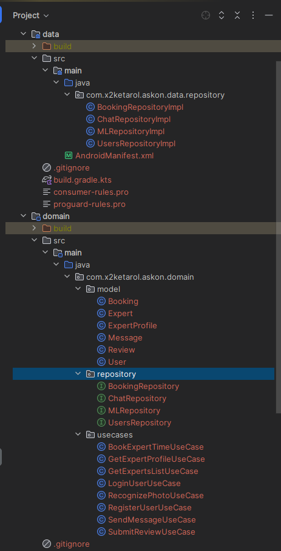
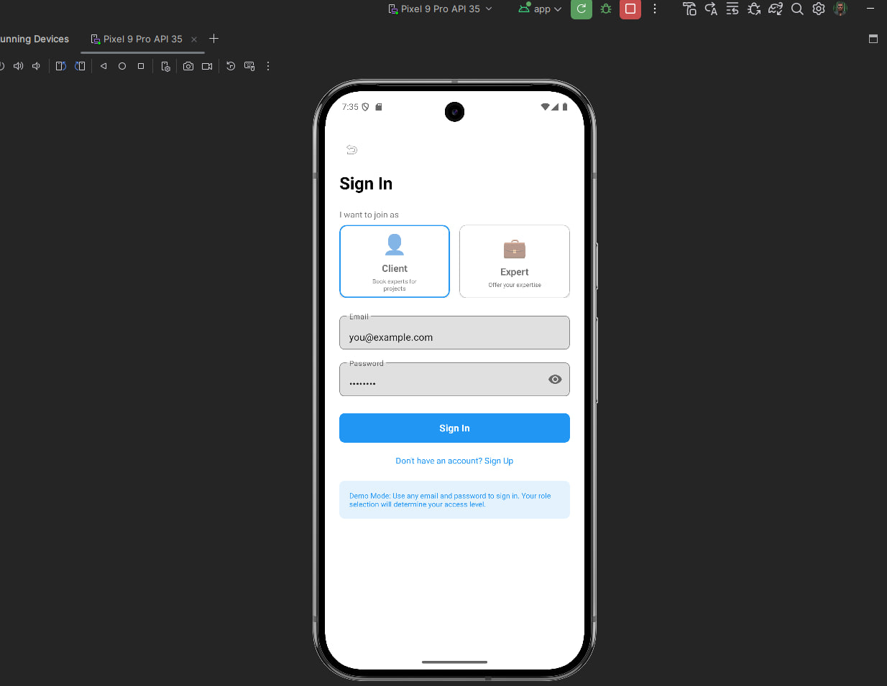
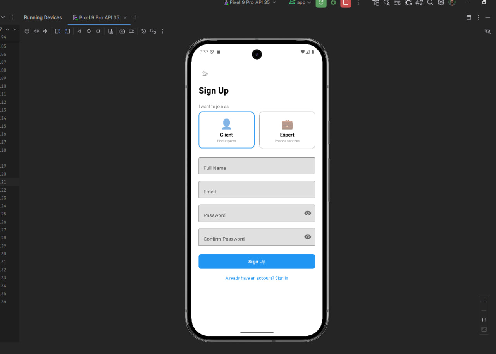
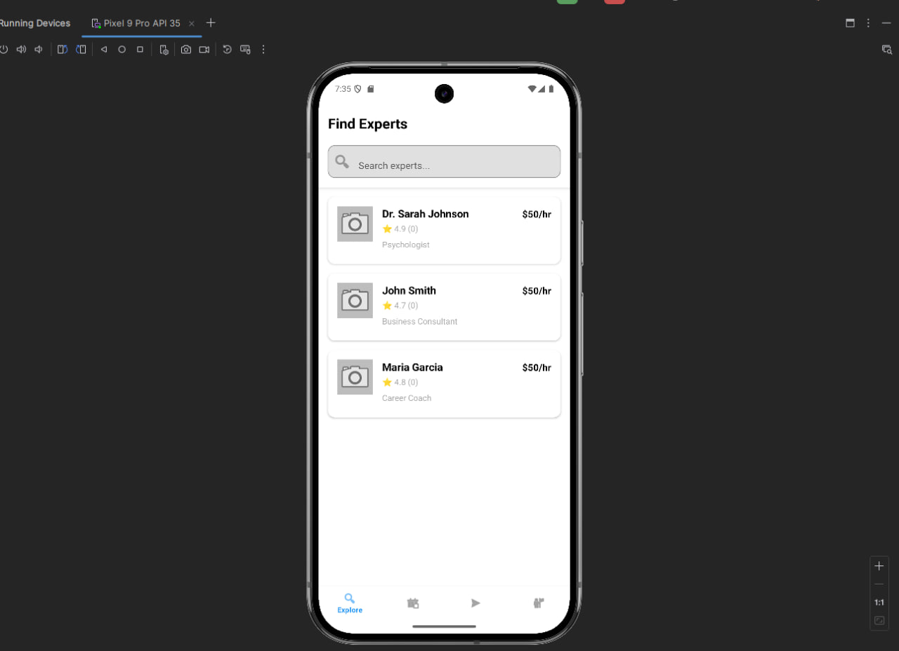
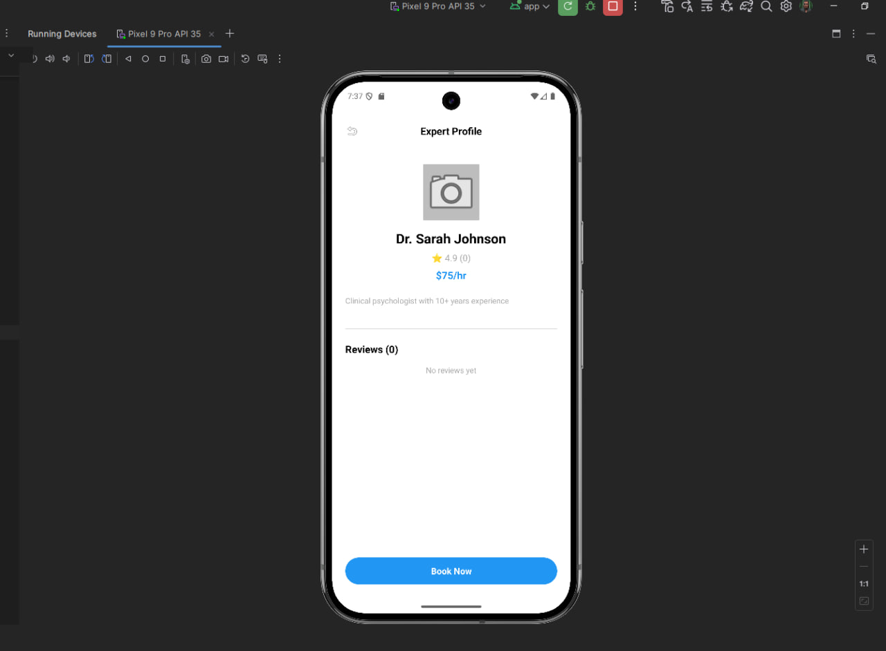
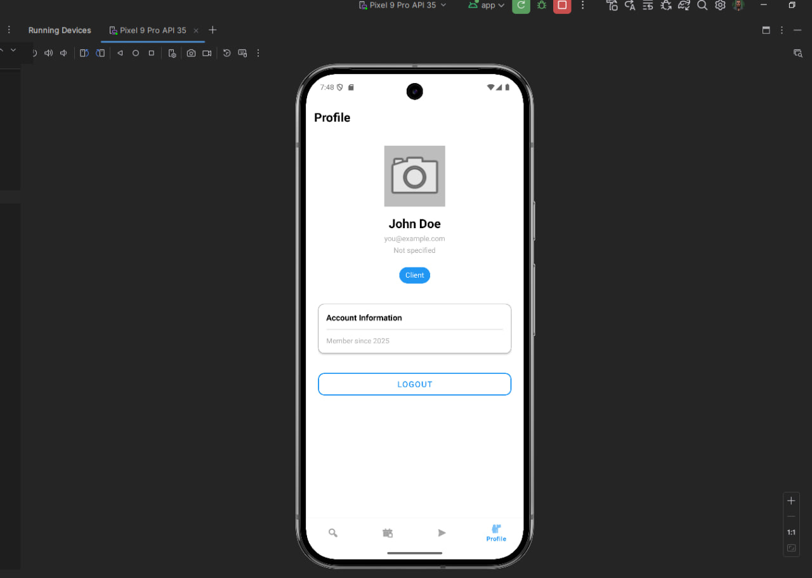

# Отчёт по практической работе

**Тема:** модульность (data/domain/app), создание прототипа приложения MovieProject, авторизация через Firebase Auth, три способа обработки данных в репозитории: SharedPreferences, Room, NetworkApi (mock).

## Цель работы

Выделить модули domain и data, разнести туда бизнес-интерфейсы и реализацию.

В app оставить только Android-UI, навигацию и связывание слоёв.

Создать прототип приложения MovieProject.

Добавить страницу авторизации с Firebase Auth и развести логику по трём модулям.

В репозиториях использовать три способа хранения/получения данных:
- SharedPreferences (информация о клиенте),
- Room (локальный кэш/избранное/фильмы),
- NetworkApi c замоканными данными (эмуляция сети).

## Архитектура и модули

### 1) Модуль domain

Содержит только чистую Java-логику:

**models/Movie** — доменная сущность (id, name).

**models/User** — модель пользователя (email, name).

**repository/MovieRepository** — интерфейс с методами:
- `boolean saveMovie(Movie movie);`
- `Movie getMovie()`.

**repository/UserRepository** — интерфейс для пользователя.

**repository/AuthRepository** — интерфейс авторизации с методами signIn, signUp, signOut.

**usecases/SaveMovieToFavoriteUseCase** — принимает MovieRepository, инкапсулирует сценарий сохранения.

**usecases/GetFavoriteFilmUseCase** — возвращает текущий «любимый» фильм.

**usecases/SignInUseCase**, **SignUpUseCase** — сценарии авторизации.

В domain нет зависимостей на Android-SDK и на конкретные реализации.

### 2) Модуль data

Реализации и источники данных:

**firebase/FirebaseAuthRepository** — реализует AuthRepository через Firebase Auth SDK.

**storage/sharedprefs/UserRepositoryImpl** — реализует UserRepository, работает с SharedPreferences для хранения email и name пользователя.

**storage/room/MovieEntity** — модель уровня хранения (id, name).

**storage/room/MovieDao** — DAO с методами insertMovie, getMovieById.

**storage/room/MovieDatabase** — база данных Room (singleton).

**storage/room/MovieRepositoryRoomImpl** — реализует MovieRepository, использует Room. Внутри выполняет маппинг между domain.models.Movie ↔ data.storage.room.MovieEntity.

**network/NetworkApi** — класс с замоканными данными (5 фильмов).

**network/MovieRepositoryNetworkImpl** — реализует MovieRepository через NetworkApi.

Таким образом, MovieRepositoryRoomImpl стал «роутером» между доменом и источниками данных. Логику доступа к конкретному источнику (Room) инкапсулирует DAO.

### 3) Модуль app (presentation)

**presentation/LoginActivity** — страница авторизации:
- поля ввода email и пароля,
- кнопки «Войти» и «Зарегистрироваться»,
- переключатель режимов.

При успешной авторизации сохраняет данные пользователя в SharedPreferences и переходит на MainActivity.

**presentation/MainActivity** — главный экран:
- проверка авторизации при запуске,
- отображение информации о пользователе (из SharedPreferences),
- поле ввода названия фильма,
- кнопка «Сохранить любимый фильм»,
- кнопка «Отобразить любимый фильм»,
- кнопка «Выйти».

Здесь же создаётся граф зависимостей вручную:

```java
FirebaseAuthRepository authRepository = new FirebaseAuthRepository();
UserRepositoryImpl userRepository = new UserRepositoryImpl(this);
MovieRepository movieRepository = new MovieRepositoryRoomImpl(this);
SaveMovieToFavoriteUseCase saveUC = new SaveMovieToFavoriteUseCase(movieRepository);
GetFavoriteFilmUseCase getUC = new GetFavoriteFilmUseCase(movieRepository);
```

Кнопки вызывают `saveUC.execute(Movie)` и `getUC.execute()`.

## Раздельные модели и мапперы

Чтобы слой data был переносимым и независимым, внедрены две модели:
- **domain.models.Movie** — используется в use case'ах и UI;
- **data.storage.room.MovieEntity** — используется внутри Room DAO.

Маппинг выполняет MovieRepositoryRoomImpl:

```java
// data → domain
private Movie mapToDomain(MovieEntity entity) {
    return new Movie(entity.getId(), entity.getName());
}

// domain → data
private MovieEntity mapToStorage(Movie movie) {
    return new MovieEntity(movie.getId(), movie.getName());
}
```

## Работа с SharedPreferences (инкапсуляция в data)

**UserRepositoryImpl** хранит/читает данные:

```java
@Override
public User getUser() {
    String email = sp.getString(KEY_USER_EMAIL, "");
    String name = sp.getString(KEY_USER_NAME, "Guest");
    return new User(email, name);
}

@Override
public boolean saveUser(User user) {
    sp.edit()
      .putString(KEY_USER_EMAIL, user.getEmail())
      .putString(KEY_USER_NAME, user.getName())
      .commit();
    return true;
}
```

Вся Android-специфика остаётся в data. domain и presentation не знают, где хранятся данные.

## Работа с Room

**MovieRepositoryRoomImpl** выполняет операции в фоновом потоке через ExecutorService:

```java
@Override
public boolean saveMovie(Movie movie) {
    MovieEntity entity = new MovieEntity(movie.getId(), movie.getName());
    movieDao.insertMovie(entity);
    return true;
}

@Override
public Movie getMovie() {
    MovieEntity entity = movieDao.getMovieById(2);
    if (entity != null) {
        return new Movie(entity.getId(), entity.getName());
    }
    return new Movie(2, "Аватар");
}
```

## Работа с NetworkApi (Mock)

**NetworkApi** содержит замоканные данные:

```java
public List<Movie> getMoviesFromNetwork() {
    List<Movie> movies = new ArrayList<>();
    movies.add(new Movie(1, "Интерстеллар"));
    movies.add(new Movie(2, "Аватар"));
    movies.add(new Movie(3, "Матрица"));
    movies.add(new Movie(4, "Начало"));
    movies.add(new Movie(5, "Темный рыцарь"));
    return movies;
}
```

**MovieRepositoryNetworkImpl** использует NetworkApi для получения данных.

## Распределение Firebase Auth по модулям

- **domain**: интерфейс AuthRepository, SignInUseCase, SignUpUseCase
- **data**: FirebaseAuthRepository (реализация)
- **app**: LoginActivity (UI и обработка ввода)

## Выводы

Выполнена модульная архитектура с чётким разделением ответственности:
- **domain** — чистая бизнес-логика без Android-зависимостей
- **data** — инкапсулирует работу с источниками данных (SharedPreferences, Room, Network)
- **app** — только UI и связывание слоёв

Реализованы три способа хранения данных:
1. **SharedPreferences** — информация о пользователе (email, name)
2. **Room** — локальная БД для фильмов с маппингом моделей
3. **NetworkApi Mock** — замоканные данные для эмуляции сети

Firebase Auth интегрирован с соблюдением Clean Architecture — domain не зависит от Firebase SDK.




## Дизайн приложения Askon

Используя Figma был создан дизайн и верстка основных страниц приложения






---
## Декомпозиция на модули
Проект был декомпозирован на модули app/domain/data (по аналогии с MovieProject).
Структура файлов изображена ниже



Дизайн приложения был воссоздан в Activities, а также вся имеющаяся логика была подключена к визуальному интерфейсу







---
## Три способа обработки данных (репозитории)

**SharedPreferences** — «Информация о пользователе»
Реализация: ProfilePreferences (модуль data.local).

Использование: в BookingsActivity, ProfileActivity, при авторизации.

Причина: небольшой объем данных (userId, имя, email), нет сложных связей, требуется быстрый доступ при запуске приложения.

---

**Room** — локальное хранилище/кэш
Сущности: Бронирования (BookingDao) и Эксперты (ExpertDao).

Экраны бронирований/детали/список экспертов работают из Room; при первом запуске — заполняется из FakeNetworkApi.

---

**NetworkApi** (FakeNetworkApi) — эмуляция сети
Отдаёт замоканный список экспертов и бронирований (id, имя эксперта, специализация, цена, дата/время бронирования, статус и т.д.).

Репозиторий (BookingRepositoryImpl, ExpertRepositoryImpl) сам решает: взять из Room или получить из «сети» и обновить Room.

---

**Типичный пользовательский поток**:
Список бронирований: getUserBookings(userId) → репозиторий → Room or FakeNetworkApi → Room → UI через RecyclerView.

**Избранные эксперты**: FavoritesRepository.toggle(expertId) и getAllFavoriteIds() для фильтрации экспертов в избранном.

**Обновление при возврате**: метод onResume() в BookingsActivity перезагружает данные для актуализации состояния.

---

**Выполнил**: Юдаев И. А. 
**Группа**: БСБО-09-22